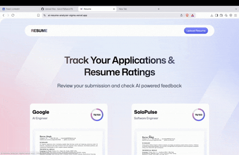

<h1 align="center">Hey there! 👋 I'm Barun</h1>

  🚀 AI Enthusiast • 💻 Developer • 📚 Lifelong Learner • 🇳🇵 From Nepal

---

### 🧠 About Me

- 🌱 Currently diving deep into **AI, ML, and full-stack development**
- 💬 I love solving real-world problems with tech
- 📍 Based in the US 🇺🇸, originally from Nepal 🇳🇵
- ✨ I believe in **starting small and improving continuously**

---

### 🔧 Tech Stack

---

### 📈 GitHub Stats

  
  

---

### 🗂️ Featured Projects
#### 📄 [AI Resume Analyzer](https://ai-resume-analyzer-sigma.vercel.app/)

  

An AI-powered web app that evaluates resumes for ATS (Applicant Tracking System) compatibility, overall quality, and tone/style.  
It provides detailed feedback and actionable tips to improve your resume’s chances of passing recruiter and ATS filters.

- 🔍 **Features**: ATS score calculation, tone/style analysis, actionable feedback, keyword optimization tips  
- 💡 **Tech Stack**: React, Node.js, OpenAI API, Express, Tailwind CSS, Vercel  
• [View Code](https://github.com/barun79/ai_resume_analyzer)

---

#### 🎬 [Movie Recommendation App](https://mymovierecomendation.netlify.app)

  

A clean and responsive React-based app that recommends trending movies using the TMDB API.  
It allows users to browse popular movies, search by title, and explore by genres — all with a sleek UI.

- 🔍 **Features**: Search, genre filtering, dynamic routing, responsive design  
- 💡 **Tech Stack**: JavaScript, React, Axios, TMDB API, React Router  
• [View Code](https://github.com/barun79/react_movie_app)
------
### 🌐 Connect with Me

---

> 🧭 "Progress isn't about big plans — it's about starting small, staying consistent, and improving in loops."
